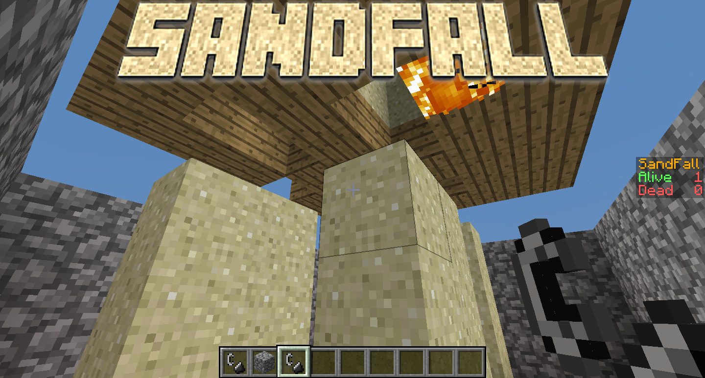

# SandFall

SandFall is a fun multi-player mini-game in which players are placed into a pre-made pit. When the countdown hits 0 and the game begins, players ignite the wood roof above them, waiting for the wood to give way. When it does, the sand on top of the wood falls down and will crush anyone it hits. If you don't die from being crushed, you'll die from suffocating in the sand. The last man standing wins.

## Documentation
- [SandFall Wiki](https://github.com/PilzBros/SandFall/wiki)

## Legacy Links
- [Spigot Page](https://www.spigotmc.org/resources/sandfall.14867/)
